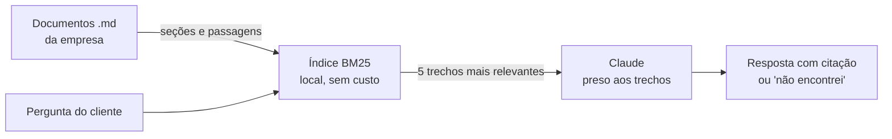

# 💬 Atendente de IA sobre documentos

Um atendente virtual que responde perguntas de clientes **usando somente os documentos da empresa**, citando de onde tirou cada informação e admitindo quando não sabe.

**Demo ao vivo: [atendente-ia.streamlit.app](https://atendente-ia.streamlit.app)**

O cenário da demonstração é uma loja de café por assinatura, com políticas de troca, frete, assinatura, pagamento, catálogo e atendimento. A base é trocável: os mesmos módulos atendem manuais de produto, contratos, normas internas ou procedimentos de qualquer negócio.

## Por que isso importa para uma empresa

Um modelo de linguagem sozinho inventa prazo de entrega e política de reembolso com total confiança. O valor aqui não está em conversar, está em **não inventar**: cada resposta é montada a partir de trechos recuperados dos documentos, vem com a citação da origem e, quando a informação não existe na base, o atendente diz isso e oferece encaminhar para uma pessoa.

## Arquitetura



## Decisões técnicas

**Busca lexical BM25, implementada do zero, em vez de embeddings.** O corpus é pequeno, as perguntas usam o vocabulário dos próprios documentos e a busca fica sem custo e sem chave de API. A interface é isolada em `busca.Indice`, então trocar por embeddings depois significa reescrever um módulo, não o sistema.

**Redução ao radical (stemming).** Sem isso a busca não liga "me arrependi" a "arrependimento" nem "vocês parcelam" a "parcelamento", que é a falha clássica de busca lexical em português. O ganho foi medido: um dos casos de teste só passa com o stemmer ativo.

**O título da seção pesa igual ao corpo.** Repetir o título para dar peso extra parecia boa ideia, mas fazia seções curtas de nome genérico ("Tempo de resposta") vencerem a seção longa que continha de fato o termo buscado.

**A métrica é recall@k, não a primeira posição.** Numa arquitetura RAG a busca existe para garantir que o trecho certo chegue ao modelo; escolher entre os trechos é trabalho do modelo, que lê todos. A pergunta "quanto tempo demora para chegar em Manaus" ilustra o limite da busca lexical: dois termos genéricos ("tempo", "chegar") casam com a seção errada e apenas um termo raro aponta a certa. Ela não fica em primeiro lugar, mas entra entre os cinco trechos enviados, e o modelo responde certo. Esse é o ponto onde embeddings passariam a compensar.

**Uma lição que vale para o cliente:** a busca só encontra o que está escrito. O documento de frete original listava apenas regiões, e nenhum cliente escreve "Norte", escreve "Manaus". Acrescentar as capitais ao documento resolveu mais do que qualquer ajuste no algoritmo.

## Como rodar

```bash
pip install -r requirements.txt
streamlit run app/app.py
```

Sem chave de API o app roda em **modo busca**, mostrando quais trechos seriam enviados ao modelo e a relevância de cada um. Com uma chave da Anthropic informada na barra lateral (ela fica só na sessão do navegador), ele gera a resposta final citada.

Para validar a busca depois de mexer nos documentos:

```bash
python tests/test_busca.py
```

## Estrutura

```
dados/                  documentos da empresa em Markdown
src/atendente/
  corpus.py             leitura, divisão em seções e passagens
  busca.py              normalização, stemming e ranking BM25
  responder.py          prompt e chamada da API com as regras anti-invenção
app/app.py              interface de chat
tests/test_busca.py     recall@5 sobre perguntas reais de cliente
```

## Do protótipo ao WhatsApp

A interface web é a camada mais fácil de trocar. `busca` e `responder` não sabem que existe Streamlit, então o mesmo núcleo atende um webhook de WhatsApp (Evolution API, Z-API ou API oficial da Meta): a mensagem entra pelo webhook, passa pela mesma busca, e a resposta volta pelo mesmo canal. O que muda em produção é o entorno: histórico por conversa, transferência para atendente humano, e registro das perguntas sem resposta, que é o dado mais valioso do sistema porque mostra o que falta nos documentos.

---
*Feito por [HM DataLabs](https://www.workana.com/freelancer/60a30ff719fa6a28abc218138cd3c3f8): Mateus Camargo e Heitor Simioni. Projeto de portfólio de IA aplicada.*
